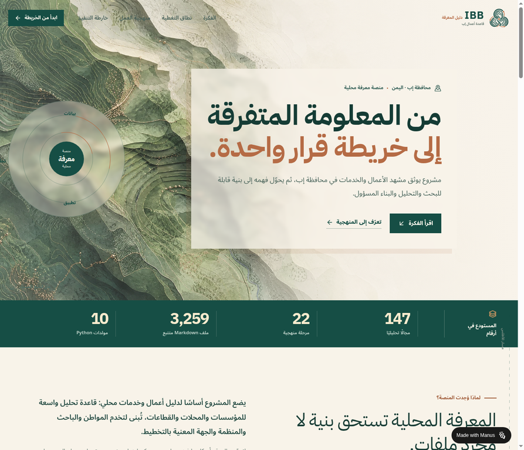

# موقع IBB Business Database

# IBB Business Database — الموقع التعريفي

واجهة عربية تعريفية مبنية بـReact وVite لتحويل تحليل مستودع **IBB Business Database** إلى تجربة تحريرية تفاعلية، تعرض الفكرة ونطاق التغطية ومنهجية التحليل وخارطة التنفيذ وبيان الحقوق والتواصل.

## روابط المشروع

| الرابط | العنوان |
|---|---|
| [الموقع المباشر](https://ibbdbase-mdqccyca.manus.space) | معاينة الموقع المنشور |
| [المستودع الرئيسي](https://github.com/tareq-alomari/ibb-business-database) | المصدر الكامل لمشروع IBB Business Database |

## معاينة الواجهة

[](https://ibbdbase-mdqccyca.manus.space)

> لقطة من الصفحة الرئيسية للموقع المنشور. انقر الصورة لفتح المعاينة الحية.

## التشغيل المحلي

يتطلب التشغيل Node.js وpnpm. من داخل هذا المجلد، ثبّت الاعتماديات ثم شغّل خادم التطوير:

```bash
pnpm install
pnpm dev
```

للتحقق من TypeScript وبناء نسخة الإنتاج:

```bash
pnpm check
pnpm build
```

## البنية

| المسار | الغرض |
|---|---|
| `client/src/pages/Home.tsx` | الصفحة العربية الرئيسية ومحتواها |
| `client/src/index.css` | الهوية البصرية المتجاوبة بأسلوب «خريطة المعرفة الحيّة» |
| `client/index.html` | إعدادات اللغة العربية والعنوان والأيقونة |
| `ideas.md` | قرارات الهوية والتوجه التصميمي |

## الأصول البصرية

تعتمد الواجهة على أصول مخصصة مرتبطة بتخزين مشروع الويب. عند نقل الموقع إلى بيئة استضافة مستقلة، ينبغي رفع هذه الأصول إلى التخزين الخاص بالبيئة الجديدة ثم تحديث مسارات `/manus-storage/` في `Home.tsx` و`index.css` و`index.html`.

## الحقوق والتواصل

يعرض الموقع بيان الاستخدام الوارد في المستودع: المشروع مخصص للاستخدام العام والتطوير المفتوح. لطلب توضيح حول إعادة الاستخدام أو التعاون، يرجى الرجوع إلى صاحب المشروع عبر بيانات التواصل التالية.

| البند | التفاصيل |
|---|---|
| صاحب المشروع | **طارق العمري / DemoSoft** |
| البريد الإلكتروني | [tareq.software.devloper@gmail.com](mailto:tareq.software.devloper@gmail.com) |
| الهاتف | [+967 715 299 909](tel:+967715299909) |
| مستودع المشروع | [tareq-alomari/ibb-business-database](https://github.com/tareq-alomari/ibb-business-database) |
